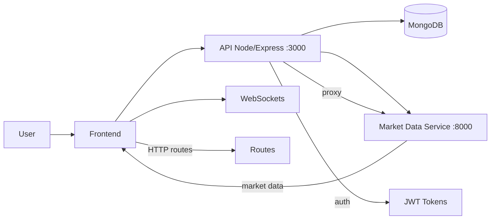
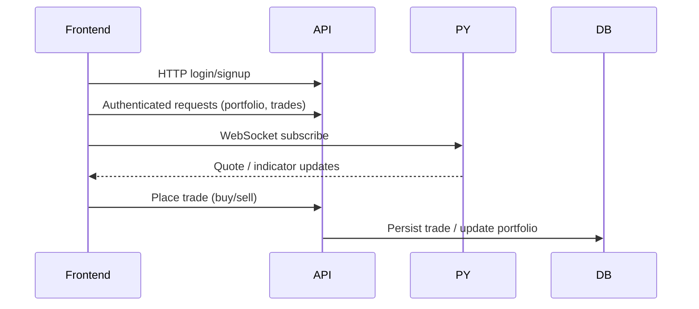

# Paper Trading App

This repository houses a full-stack paper-trading application. It features a React + Vite frontend, an Express API that manages user auth and trade persistence in MongoDB, and a Python FastAPI service that supplies real-time market data and technical indicators powered by Yahoo Finance.

---

## Architecture & Component Map

### System Architecture



### Component Map (Where to look)

* **Frontend:** `src/` — Main router located at `src/routes/AppRouter.jsx`.
* **Backend API:** `server/server.js` — Main Express server and route handlers.
* **Market Data Pipelines:** `YahooFinanceDataPipeline/Main/server.py` — FastAPI endpoints handling technical indicators, pricing data, and search.

---

## Quick Start (Development)

### Prerequisites

Ensure you have **Node.js (v18+)**, **Python 3.10+**, and a running instance of **MongoDB** installed on your machine.

### 1. Install Node Dependencies

From the repository root, install the dependencies for both the frontend and the Express server:

```bash
npm install

```

### 2. Configure Environment Variables

Create a `.env` file in the root directory of the project:

```env
MONGO_URL=mongodb://localhost:27017/paper-trading
JWT_SECRET=change_this_to_a_secure_secret_in_production

```

### 3. Spin up the Python Market-Data Service

The Python service must be running for the Express API to fetch stock data properly.

```bash
cd YahooFinanceDataPipeline/Main
python -m venv .venv

```

* **On macOS/Linux:** `source .venv/bin/activate`
* **On Windows (CMD):** `.venv\Scripts\activate.bat`

```bash
pip install -r requirements.txt
# Note: If requirements.txt is missing, fallback to:
# pip install fastapi uvicorn pandas yfinance talib

uvicorn server:app --reload --host 127.0.0.1 --port 8000

```

> **Note:** The Express server expects this service to be running explicitly at `http://127.0.0.1:8000`.

### 4. Start the Node Express API

Open a new terminal window, navigate back to the project root, and run:

```bash
node server/server.js

```

The API will spin up on port `3000`.

### 5. Start the Frontend Dev Server

Open another terminal window at the project root and run:

```bash
npm run dev

```

Vite will host the frontend at `http://localhost:5173` and automatically proxy endpoints targeting port `3000` via its internal configuration (`vite.config.js`).

---

## Ports, Endpoints, & Environments

### Port Reference Table

| Service | Port | Key Endpoints / Features |
| --- | --- | --- |
| **Frontend (Vite)** | `5173` | UI Client Dashboard |
| **Express API** | `3000` | `/sign-up`, `/login`, `/portfolio`, `/buy`, `/sell`, `/data`, `/quote` |
| **FastAPI Service** | `8000` | `/indicators/*`, `/data`, `/quote`, `/search` |

### Environment Setup

* `MONGO_URL`: Connection string for MongoDB database.
* `JWT_SECRET`: Secret key used to sign authorization tokens (1-hour default expiration lifecycle).

> **Tip:** If you need to map custom ports, remember to update `server/server.js`, `vite.config.js` (proxy targets), and the WebSocket connection strings inside `src/lib/wsManager.js`.

---

## Key Files Directory

* **API Entrypoint:** `server/server.js`
* **Query & Business Logic:** `server/queryManager.js`
* **MongoDB Schema Definition:** `server/Schemas/mongoSchema.js`
* **Frontend Client Routing:** `src/routes/AppRouter.jsx`
* **WebSocket State Manager:** `src/lib/wsManager.js`
* **Market-Data Backend:** `YahooFinanceDataPipeline/Main/server.py`

---

## Data Flow (Subscription Lifecycle)



---

## Troubleshooting & Dev Tips

* **Authentication Issues:** Ensure all requests to protected Express routes include the `Authorization: Bearer <token>` header.
* **MongoDB Connection Failures:** Ensure your local Mongo daemon is active (`mongod`) and matches your `.env` connection string.
* **Missing Market Data:** If indicators or quotes fail to load, check that the FastAPI server on port `8000` is active and hasn't run into a `yfinance` rate limit.
* **CORS / Proxy Misconfigurations:** If network calls return 404 errors in the browser, double-check the target setups inside `vite.config.js`.

---

## Production Builds

To compile the frontend package for production deployment, run:

```bash
npm run build

```

The production assets will optimize into a static `/dist` directory, ready to be served via Nginx or integrated into your Express static asset handler.

---

## Contributing

* Open an issue for bugs, structural feedback, or feature requests.
* Create feature branches and submit pull requests with focused, testable changes.


https://github.com/user-attachments/assets/89af33dc-971e-4b24-9ae1-a9e26596a0c3


