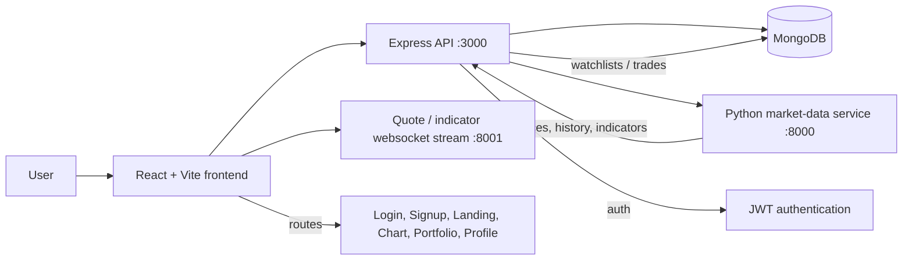

# Paper Trading App

A full-stack paper trading platform for exploring stocks, placing simulated trades, tracking a portfolio, and monitoring watchlists and stop-loss orders.

The app is split into three parts:

- A React + Vite frontend for authentication, charting, portfolio views, and trade actions.
- An Express + MongoDB API for user accounts, portfolio data, trade history, watchlists, and stop-loss storage.
- A Python market-data service that fetches quotes, historical data, search results, and technical indicators.

## Architecture



### Frontend

The frontend lives in [src/](src) and is routed from [src/routes/AppRouter.jsx](src/routes/AppRouter.jsx).

- [src/pages/login.jsx](src/pages/login.jsx) and [src/pages/signup.jsx](src/pages/signup.jsx) handle authentication.
- [src/pages/landingPage.jsx](src/pages/landingPage.jsx), [src/pages/stockChart.jsx](src/pages/stockChart.jsx), [src/pages/portfolioPage.jsx](src/pages/portfolioPage.jsx), and [src/pages/userProfile.jsx](src/pages/userProfile.jsx) make up the protected app area.
- [src/lib/wsManager.js](src/lib/wsManager.js) connects the UI to live quote and indicator streams.

### Backend

The Node server lives in [server/server.js](server/server.js).

- Authentication uses JWT.
- Persistent data is stored in MongoDB through Mongoose.
- Trade execution, watchlists, user data, and stop-loss management are handled by the API.
- Market data requests are forwarded to the Python service.

### Market Data Service

The Python service lives in [YahooFinanceDataPipeline/server.py](YahooFinanceDataPipeline/server.py).

- It serves quote and historical data from Yahoo Finance.
- It exposes indicator endpoints for SMA, EMA, RSI, Bollinger Bands, stochastic oscillator, volume, and OBV.
- It also provides search results for symbols.

## Setup

### Prerequisites

- Node.js 18 or newer
- npm
- Python 3.10 or newer
- MongoDB running locally or a MongoDB connection string

### 1. Install the frontend and API dependencies

From the project root:

```bash
npm install
```

### 2. Configure environment variables

Create a `.env` file for the Node API with:

```bash
MONGO_URL=your_mongodb_connection_string
JWT_SECRET=your_jwt_secret
```

If your Python service needs its own environment, create and activate it before starting the service.

### 3. Start the Python market-data service

From the `YahooFinanceDataPipeline` directory, install the Python packages used by the service and run it on port `8000`.

Example:

```bash
python -m venv .venv
source .venv/bin/activate
pip install fastapi uvicorn pandas yfinance TA-Lib
uvicorn server:app --reload --host 127.0.0.1 --port 8000
```

### 4. Start the Node API server

From the project root, run:

```bash
node server/server.js
```

The API listens on port `3000`.

### 5. Start the frontend

In a second terminal, run:

```bash
npm run dev
```

Vite starts the frontend on port `5173` and proxies API calls to the Node server.

## Project Structure

```text
src/                    React app, pages, hooks, charts, and UI state
server/                 Express API, MongoDB queries, trade logic, stop-loss logic
YahooFinanceDataPipeline/ Python market-data service and indicator calculations
```

## Notes

- The frontend expects live quote and indicator websocket services to be available at the addresses configured in [src/App.jsx](src/App.jsx).
- If you change backend ports, update [vite.config.js](vite.config.js) and the websocket URLs in the frontend.
